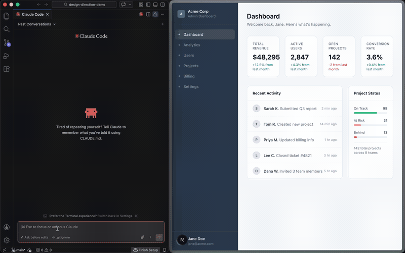

# design-direction

An AI coding assistant skill that helps you explore design decisions on your existing codebase, without leaving your editor.

<p align="center">
  
</p>

Ask any design question. The skill reads your code, generates a browser preview showing your current design alongside 4 functional alternatives, and applies the one you pick.

---

## Installation

Requires an AI coding assistant that supports custom skills (e.g. [Claude Code](https://docs.anthropic.com/en/docs/claude-code/overview)).

```bash
mkdir -p ~/.claude/skills/design-direction

curl -o ~/.claude/skills/design-direction/SKILL.md \
  https://raw.githubusercontent.com/jnemargut/design-direction/main/SKILL.md

curl -o ~/.claude/skills/design-direction/detect-stack.sh \
  https://raw.githubusercontent.com/jnemargut/design-direction/main/detect-stack.sh

chmod +x ~/.claude/skills/design-direction/detect-stack.sh
```

No npm install, no config files.

---

## Usage

Open your AI coding assistant in any web project and run:

```
/design-direction "the sidebar color is too bland"
```

A browser preview opens showing your **current design** plus **Options A, B, C, and D** with live renders, rationale, and pros/cons. Then tell the assistant what you want:

- **"Go with Option A"** — applies the changes to your source files
- **"Option C but darker"** — applies with your modification
- **"Give me more choices"** — adds 4 more options (E, F, G, H) to the preview. Keep going as many rounds as you want.

### More examples

```
/design-direction "explore font options for the landing page"
/design-direction "the dashboard looks too corporate"
/design-direction "tighten up the spacing on the settings page"
/design-direction "should this confirmation be a modal or inline?"
/design-direction "the primary button isn't standing out enough"
/design-direction "I want the hero to have more personality"
/design-direction "switch the sidebar to a darker color scheme"
```

### Ask about any design question

Colors, typography, spacing, layouts, button styles, navigation, cards, dark mode, data visualization, interaction patterns, empty states, hover states, destructive actions, confirmation flows, mood and tone, or anything else.

**Works with:** React, Next.js, Vue, Svelte, vanilla HTML

---

## How it works

| Phase | What happens |
|-------|-------------|
| **1. Clarify** | Parses your question; asks one follow-up if needed |
| **2. Detect stack** | Identifies your framework (React, Vue, Svelte, Next.js, vanilla HTML) |
| **3. Find the code** | Searches your codebase for the relevant component or styles |
| **4. Generate options** | Creates 4 distinct design directions |
| **5. Preview** | Writes a self-contained HTML preview with functional renders |
| **6. Open** | Opens the preview in your browser |
| **7. Apply** | Edits your source files surgically for the option you choose |

Changes are precise: only the specific design values are touched, not surrounding logic or structure.

---

## License

AGPL-3.0
